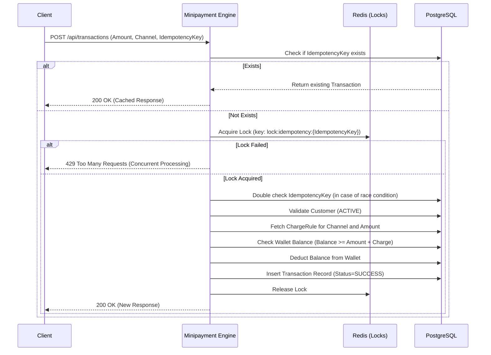
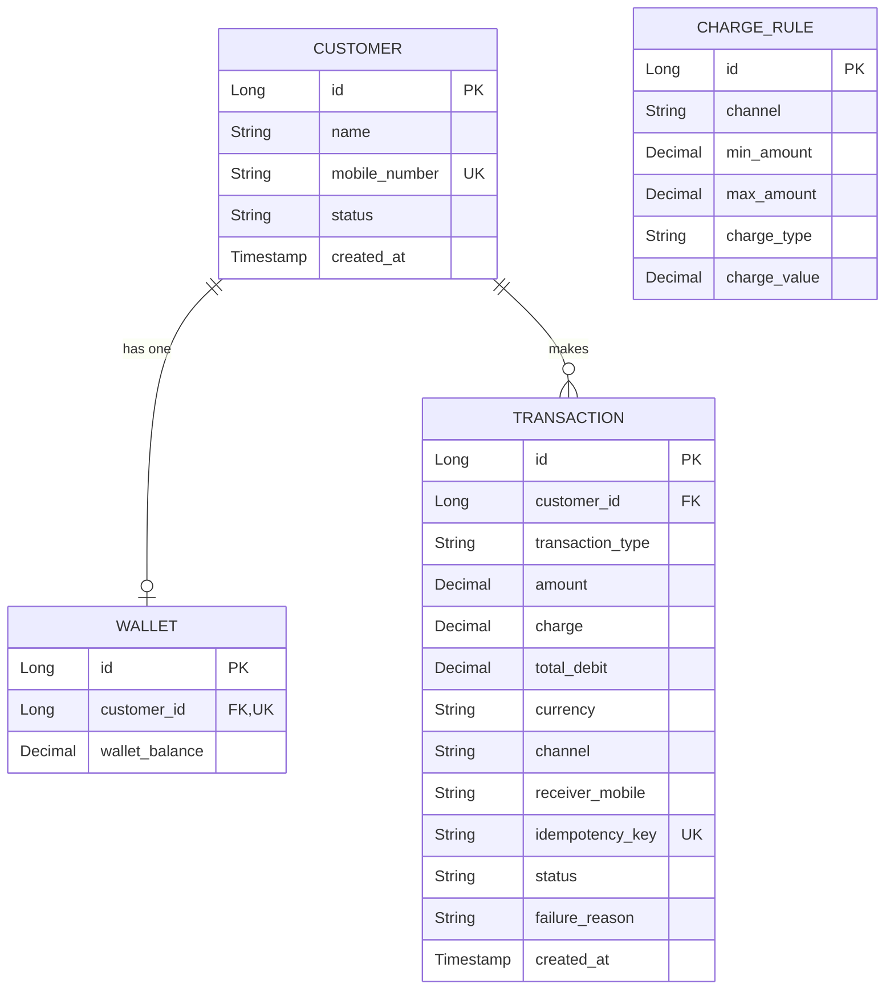

# Mini Payment Charge & Wallet Transaction Engine - High Level Design (HLD)

## 1. System Component Architecture
The system is built as a single Spring Boot microservice running on Java 21.

*   **API Gateway (Optional):** Routes traffic to the backend engine.
*   **Minipayment Engine (App):** Exposes REST APIs, handles business logic, and orchestrates transactions.
*   **PostgreSQL 16:** The primary persistent store for Customers, Wallets, Transactions, and Charge Rules.
*   **Redis 7.0:** Used for distributed locking to ensure idempotency.
*   **Prometheus & Grafana:** For metrics collection and visualization.
*   **OpenTelemetry:** Tracing and observability integrated via Logback appender.

## 2. Sequence Flow Diagram (Idempotent Transaction Processing)

## 3. Entity Relationship Diagram (ERD)

## 4. Dynamic Charge Rule Logic
Charge rules are configured dynamically per channel and amount range.
*   `FIXED`: The `charge_value` is directly added to the amount.
*   `PERCENTAGE`: The `charge_value` is calculated as `(amount * charge_value) / 100`.
If no rule matches the given amount and channel, the transaction is rejected to prevent un-charged transactions.

## 5. Reversals & Monitoring
*   **Reversals:** For the MVP, reversals can be achieved via manual DB operations or implementing a `/reversal` endpoint that credits the wallet and creates a `REVERSAL` transaction type.
*   **Monitoring:** The app exposes `/actuator/prometheus` which Prometheus scrapes every 10 seconds.
